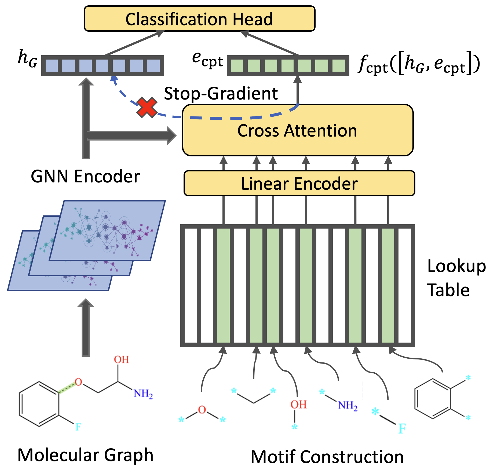

# MolCPT: Molecule Continuous Prompt Tuning to Generalize Molecular Representation Learning

PyTorch implementation for MolCPT. Author list withheld during review.

## Overview

We provide a PyTorch implementation of MolCPT with GIN backbone. Pre-trained weights can be found by referencing [the original GraphCL README](https://github.com/Shen-Lab/GraphCL/blob/master/README.md). Datasets can be downloaded [here](https://github.com/snap-stanford/pretrain-gnns#dataset-download).

 

Environment file can be found under the transferLearning_MoleculeNet_PPI subdirectory. If there are package incompatibility issues, you may want to instead create your environment using the file provided by GraphCL [here](https://github.com/CameronDiao/GraphCL/blob/master/transferLearning_MoleculeNet_PPI/environment.yml).

## Finetuning

To run MolCPT on GraphCL, navigate to the finetuning file [here](https://github.com/CameronDiao/GraphCL/tree/master/transferLearning_MoleculeNet_PPI/chem) and edit the hyperparameters passed to the main function. We expose dropout, normalization, and filtering threshold as changeable hyperparameters. 

Finally, run the following commands on terminal (assuming you already cd'd into the top-level of the MolCPT repository):

```
cd ./transferLearning_MoleculeNet_PPI/chem/
python finetune_motif.py
```

Results will be recorded in ```result.log```.
